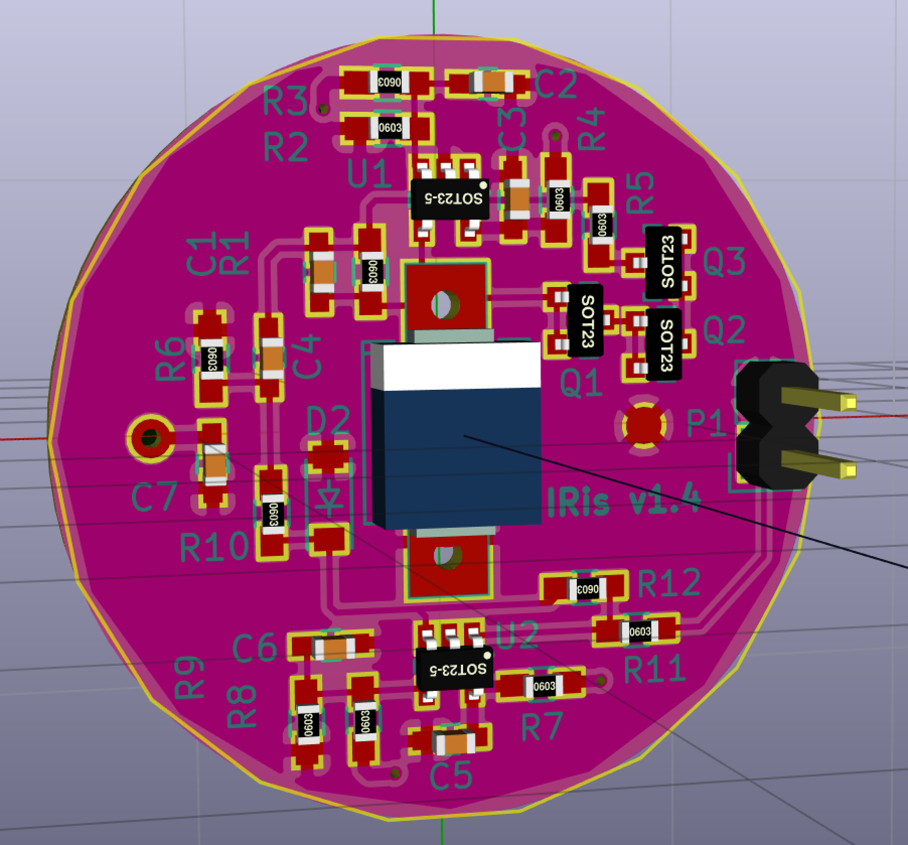

What?
=====

IRis is a low power, low cost, high sensitivity infrared detector designed for capturing raw IR digital data transmissions. Think of it like a mon0 interface for IR.

Why?
====

Typical [IR](https://www.sparkfun.com/products/10266) [receivers](http://dangerousprototypes.com/docs/USB_IR_Toy_v2) are designed to work with common IR remote controls, and as such expect the received data to be [modulated at 38kHz](http://www.vishay.com/docs/80071/dataform.pdf). Because of this, there is so much more the world of IR that these receivers simply cannot detect!

In contrast, IRis was designed to be a simple, general purpose IR detector to aid in the capture and analysis of raw IR transmissions from a variety of sources, such as:

 * IR remote controls
 * Cell phone proximity sensors 
 * Traffic signal preemption systems
 * Close range digital transmissions

How?
====

Most IR data is transmitted via on/off pulses (i.e., on-off keying). Powered from a single CR2032 coin cell battery, IRis uses a a sensitive photodiode, high gain transimpedance amplifier, and comparator to detect even very weak IR signals and convert them back into clean digital pulses that can be interpreted and analyzed by nearly any digital system, such as an Arduino or Raspberry Pi.

Who?
====

The brainchild of [Dale Wooden](https://www.linkedin.com/in/dale-wooden-1b1bb288), and designed by [Craig Heffner](http://www.analogzoo.com), IRis is of use to anyone interested in exploring the hidden world of IR around them!

How Much?
=========

PCBs (1.24 inches in diameter) are available from [OSHPark](https://oshpark.com/shared_projects/OFeMS3Ed) for less than $8, and components can be ordered from [Digikey](./digikey_bom.csv) for less than $8 in single quantities.

What's The Catch?
=================

Despite its simplicity, small size, low cost, long battery life, and high sensitivity, IRis suffers from limited [dynamic range](https://en.wikipedia.org/wiki/Dynamic_range). This is an inherent by-product of its high sensitivity, and simply means that weak IR signals can be masked by strong, unwanted, light sources.

In conditions where there is low ambient light this is not a major problem, and in areas of greater illumination the issue can be mitigated by placing a shroud around the IR detector to prevent direct contact with unwated light. IR filters can also be used to reduce interference from unwanted light sources, but bear in mind that some bright light sources (e.g., the sun!) emit IR radiation as well.

IRis is still able to detect IR transmissions in the presence of bright ambient light, just at a reduced distance.

